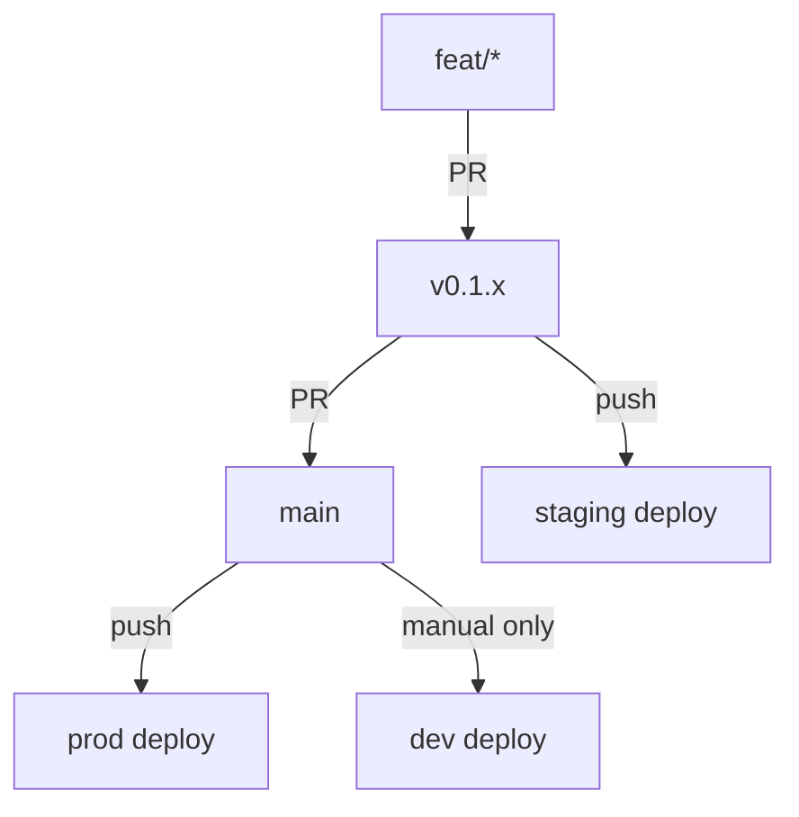
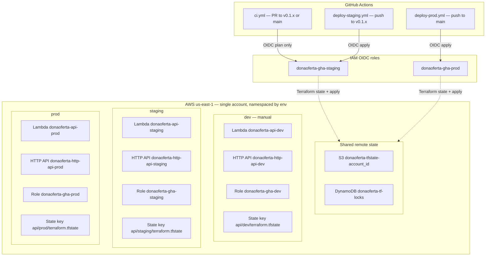
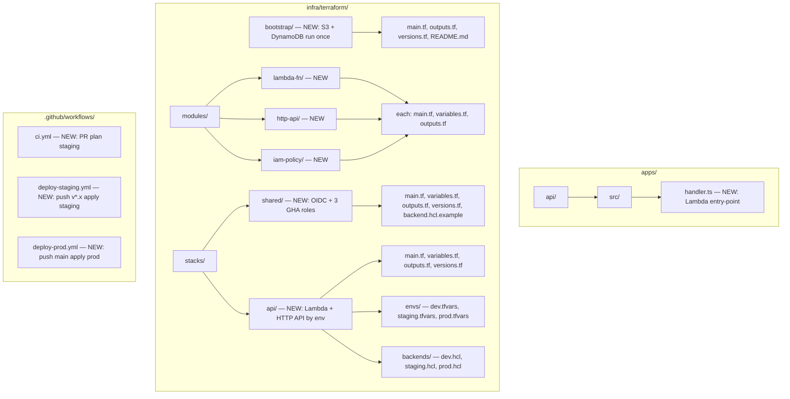
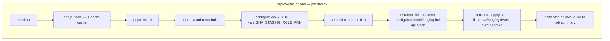
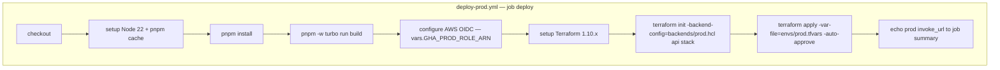
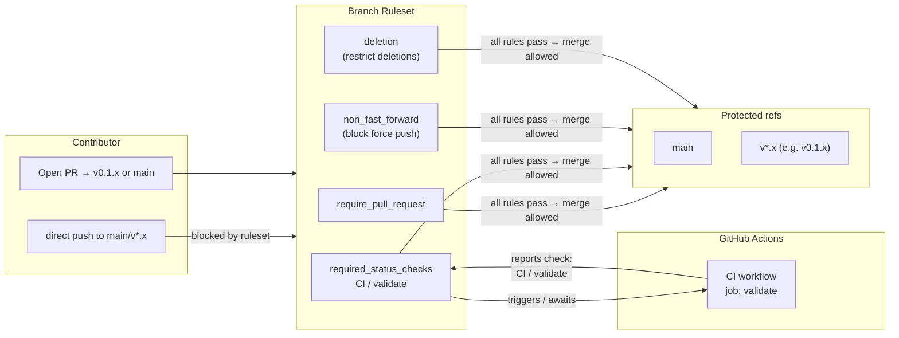

# infra-terraform-base Design

**Spec:** [`./spec.md`](./spec.md)
**Status:** Implemented in repo (operator checklist TI10 still applies per environment / PR).

---

## Context

`foundation-monorepo` shipped a working local `apps/api`. This feature completes M0 by deploying that app to AWS and automating the pipeline. No new business logic is added — only the infrastructure layer and CI/CD wiring.

---

## Architecture Overview





> **Note:** `account_id` is the AWS account id (see Terraform `data.aws_caller_identity`). Workflows assume repo variables supply the staging and prod role ARNs.

---

## Key Decisions

### KD-1 — Lambda handler adapter: `hono/aws-lambda`

Hono ships an official Lambda adapter (`hono/aws-lambda`) that converts API Gateway HTTP API v2 events to a `Request` object, runs the Hono app, and converts the `Response` back to the Lambda return shape. This is the canonical Hono-on-Lambda pattern.

```typescript
// apps/api/src/handler.ts
import { handle } from 'hono/aws-lambda'
import { compose } from './compose.js'

const app = compose()
export const handler = handle(app)
```

No additional npm packages needed — `hono/aws-lambda` is included in the `hono` package already in `packages/http-kit`.

### KD-2 — Lambda packaging: tsup second entry-point + `archive_file` Terraform data source

`tsup.config.ts` is extended with a second entry: `src/handler.ts → dist/handler.mjs`. The Terraform `archive_file` data source zips `dist/handler.mjs` at plan time. `aws_lambda_function` uses `filename` referencing the zip. This keeps the artifact self-contained with no S3 upload step and stays within Lambda's 50 MB unzipped limit (current bundle ≈ 76 KB).

### KD-3 — Terraform remote state: S3 versioning + SSE-S3

Bucket name: `donaoferta-tfstate-${data.aws_caller_identity.current.account_id}` to avoid global name conflicts. Server-side encryption with `AES256` (SSE-S3) — no KMS to stay free-tier. Versioning enabled for state history.

### KD-4 — Terraform version: 1.10.x, AWS provider ~> 5.0

`required_version = "~> 1.10"` pinned in every stack. AWS provider `~> 5.0` (latest stable 5.x). Provider source locked in `versions.tf`.

### KD-5 — OIDC scope: one role per environment, scoped branch filter

Three separate IAM roles with different trust conditions. Using `StringLike` on `token.actions.githubusercontent.com:sub`:

| Role | Trust `sub` pattern | Used by |
|---|---|---|
| `donaoferta-gha-dev` | `repo:digitalelvis/dona:*` (any ref) | manual local apply |
| `donaoferta-gha-staging` | `repo:digitalelvis/dona:ref:refs/heads/v*` OR `pull_request` | `deploy-staging.yml` + `ci.yml` |
| `donaoferta-gha-prod` | `repo:digitalelvis/dona:ref:refs/heads/main` | `deploy-prod.yml` |

Separate roles give clear blast-radius boundaries: a compromised staging token cannot touch prod resources. The `staging` role is also used by the `ci.yml` plan step (read-only via `terraform plan`).

### KD-6 — IAM permissions: least-privilege inline policy per role

Each of the three roles carries the same action set (minimum required for Terraform plan + apply on the `api` stack):
- S3 state: `s3:GetObject`, `s3:PutObject`, `s3:ListBucket`, `s3:DeleteObject`
- DynamoDB lock: `dynamodb:GetItem`, `dynamodb:PutItem`, `dynamodb:DeleteItem`
- Lambda: `lambda:UpdateFunctionCode`, `lambda:UpdateFunctionConfiguration`, `lambda:GetFunction`, `lambda:PublishVersion`, `lambda:CreateFunction`, `lambda:DeleteFunction`, `lambda:TagResource`
- API Gateway: `apigateway:GET`, `apigateway:POST`, `apigateway:PUT`, `apigateway:DELETE`, `apigateway:PATCH`
- IAM (Terraform self-reads): `iam:GetRole`, `iam:GetRolePolicy`, `iam:ListRolePolicies`, `iam:ListAttachedRolePolicies`, `iam:GetOpenIDConnectProvider`, `iam:PassRole`
- `sts:GetCallerIdentity`

Resource-level scoping: Lambda and API GW actions are scoped to `arn:aws:lambda:us-east-1:*:function:donaoferta-api-<env>` and `arn:aws:execute-api:us-east-1:*` respectively, where `<env>` matches the role's environment. No cross-environment resource access.

No admin or wildcard `*:*` permissions.

### KD-9 — Naming convention: `donaoferta-<component>-<environment>`

All AWS resources follow the pattern `donaoferta-<component>-<environment>` where `environment` comes from `var.environment` (never hardcoded). This makes it trivial to identify the environment of any resource in the AWS console and prevents accidental cross-environment operations.

Examples:
- Lambda functions: `donaoferta-api-dev`, `donaoferta-api-staging`, `donaoferta-api-prod`
- API Gateways: `donaoferta-http-api-dev`, `donaoferta-http-api-staging`, `donaoferta-http-api-prod`
- IAM roles: `donaoferta-gha-dev`, `donaoferta-gha-staging`, `donaoferta-gha-prod`
- Terraform state keys: `api/dev/terraform.tfstate`, `api/staging/terraform.tfstate`, `api/prod/terraform.tfstate`
- Shared state key: `shared/terraform.tfstate` (single — OIDC provider is per-account, not per-env)

### KD-7 — CI caches pnpm store

CI workflow caches the pnpm store with `actions/cache` keyed on `pnpm-lock.yaml` hash. Saves ~30 s on subsequent runs.

### KD-8 — Terraform installed via `hashicorp/setup-terraform` action

Pinned to `v3` of the action with `terraform_version: "1.10.*"`. No manual PATH manipulation.

---

## Repository Layout (additions)



---

## apps/api Handler Details

### `src/handler.ts`

```typescript
import { handle } from 'hono/aws-lambda'
import { compose } from './compose.js'

const app = compose()
export const handler = handle(app)
```

### `tsup.config.ts` additions

Add a second entry `src/handler.ts` with the same ESM output config:
```typescript
entry: ['src/local.ts', 'src/handler.ts'],
```

### Unit test: `test/handler.test.ts`

Construct a minimal API Gateway HTTP API v2 event object, invoke the exported `handler` function, assert `statusCode === 200` and body parses as `{ status: 'ok' }`.

The `@types/aws-lambda` package provides the `APIGatewayProxyEventV2` type for the test.

---

## Terraform Module Interfaces

### `modules/lambda-fn`

**Variables:**

| Name | Type | Required | Description |
|---|---|---|---|
| `function_name` | string | yes | Lambda function name |
| `handler` | string | yes | Entry-point (e.g. `handler.handler`) |
| `runtime` | string | yes | `nodejs22.x` |
| `filename` | string | yes | Path to the zip file |
| `source_code_hash` | string | yes | `filebase64sha256(var.filename)` for forced updates |
| `memory_size` | number | no (128) | MB |
| `timeout` | number | no (10) | Seconds |
| `environment` | string | yes | Tag label (`dev`, `staging`, `prod`) merged into resource tags |
| `architecture` | string | no (`arm64`) | Lambda CPU architecture (`arm64` or `x86_64`) |
| `environment_variables` | map(string) | no ({}) | Env vars injected (block omitted when empty) |
| `layers` | list(string) | no ([]) | Layer ARNs |
| `tags` | map(string) | no ({}) | Additional tags |

**Tracing:** `aws_lambda_function` sets `tracing_config { mode = "PassThrough" }` so X-Ray / ADOT can own segment creation when layers and env vars are added under `observability-base`.

**Outputs:** `function_arn`, `function_name`, `invoke_arn`, `role_arn`

### `modules/http-api`

**Variables:**

| Name | Type | Required | Description |
|---|---|---|---|
| `name` | string | yes | API Gateway name |
| `lambda_invoke_arn` | string | yes | Lambda `invoke_arn` |
| `lambda_function_name` | string | yes | For `aws_lambda_permission` |
| `tags` | map(string) | no ({}) | Additional tags |

**Outputs:** `api_id`, `invoke_url`, `execution_arn`

### `modules/iam-policy`

**Variables:**

| Name | Type | Required | Description |
|---|---|---|---|
| `policy_name` | string | yes | Name for the inline policy |
| `role_name` | string | yes | IAM role to attach to |
| `effect` | string | no ("Allow") | "Allow" or "Deny" |
| `actions` | list(string) | yes | IAM actions |
| `resources` | list(string) | yes | ARNs |

**Outputs:** `policy_id`

---

## Terraform Stack `shared`

Provisions:
1. `aws_iam_openid_connect_provider` — `token.actions.githubusercontent.com` (one per account; uses `data` source if already exists via `try` + `count`)
2. Three `aws_iam_role` resources — `donaoferta-gha-dev`, `donaoferta-gha-staging`, `donaoferta-gha-prod` — each with its own OIDC trust policy per KD-5
3. Three `module.gha_policy` instances (from `iam-policy`) — one per role, with resource-scoped actions per KD-6

Backend (single state file — the shared stack is environment-agnostic):
```hcl
terraform {
  backend "s3" {
    bucket         = "donaoferta-tfstate-<account_id>"   # set via -backend-config
    key            = "shared/terraform.tfstate"
    region         = "us-east-1"
    dynamodb_table = "donaoferta-tf-locks"
    encrypt        = true
  }
}
```

Outputs:
```hcl
output "role_arns" {
  value = {
    dev     = aws_iam_role.gha_dev.arn
    staging = aws_iam_role.gha_staging.arn
    prod    = aws_iam_role.gha_prod.arn
  }
}
output "oidc_provider_arn" { value = local.oidc_provider_arn }
```

---

## Terraform Stack `api`

Parameterized by `var.environment` (set via `-var-file=envs/<env>.tfvars`). Same `main.tf` for all three environments; the backend is selected via `-backend-config=backends/<env>.hcl`.

Provisions:
1. `data.archive_file` — zips `../../apps/api/dist/handler.mjs` → `handler.zip`
2. `module.lambda` — Lambda function `donaoferta-api-${var.environment}` with memory/timeout/`log_level` (as `LOG_LEVEL` env), `lambda_architecture` from tfvars (default `arm64`), and optional layers reserved for ADOT (`observability-base`)
3. `module.http_api` — API Gateway `donaoferta-http-api-${var.environment}` routing all `$default` requests to the Lambda

`envs/dev.tfvars`:
```hcl
environment         = "dev"
memory_size         = 128
timeout             = 10
log_level           = "debug"
lambda_architecture = "arm64"
```

`envs/staging.tfvars`:
```hcl
environment         = "staging"
memory_size         = 128
timeout             = 10
log_level           = "info"
lambda_architecture = "arm64"
```

`envs/prod.tfvars`:
```hcl
environment         = "prod"
memory_size         = 256
timeout             = 15
log_level           = "warn"
lambda_architecture = "arm64"
```

`backends/dev.hcl`:
```hcl
bucket         = "donaoferta-tfstate-<account_id>"
key            = "api/dev/terraform.tfstate"
region         = "us-east-1"
dynamodb_table = "donaoferta-tf-locks"
encrypt        = true
```

`backends/staging.hcl` and `backends/prod.hcl` follow the same pattern with keys `api/staging/terraform.tfstate` and `api/prod/terraform.tfstate`.

Terraform apply command pattern:
```bash
terraform init -backend-config=backends/<env>.hcl
terraform apply -var-file=envs/<env>.tfvars -auto-approve
```

---

## CI/CD Workflow Design

### `ci.yml` — triggers on PR to `v0.1.x` or `main`

Uses `donaoferta-gha-staging` role (plan-only; no `apply`). Plans against the `staging` environment to detect Terraform drift before merges.

```mermaid
flowchart TD
  subgraph ci["ci.yml — job validate"]
    c1[checkout]
    c2["setup Node 22 + pnpm cache"]
    c3[pnpm install]
    c4[pnpm typecheck]
    c5[pnpm lint]
    c6["pnpm -w turbo run test"]
    c7["pnpm -w turbo run build"]
    c8["configure AWS OIDC — vars.GHA_STAGING_ROLE_ARN"]
    c9["setup Terraform 1.10.x"]
    c10["terraform init -backend-config=backends/staging.hcl api stack"]
    c11[terraform validate]
    c12["terraform plan -var-file=envs/staging.tfvars"]

    c1 --> c2 --> c3 --> c4 --> c5 --> c6 --> c7 --> c8 --> c9 --> c10 --> c11 --> c12
  end
```



### `deploy-staging.yml` — triggers on push to `v*.x` branches (development mainlines)



### `deploy-prod.yml` — triggers on push to `main`



GitHub repository variables (not secrets) needed:
- `GHA_STAGING_ROLE_ARN` — ARN of `donaoferta-gha-staging`
- `GHA_PROD_ROLE_ARN` — ARN of `donaoferta-gha-prod`

---

## GitHub Branch Rulesets

### KD-10 — Branch Rulesets (modern API) vs classic branch protection

GitHub offers two enforcement mechanisms: the legacy "Branch protection rules" (per-branch, no bypass tiers) and the newer "Branch Rulesets" (per-repo or org, pattern-based, granular bypass actors, importable/exportable). Rulesets are chosen here because they support:

- Multiple target patterns in a single rule (e.g. `~DEFAULT_BRANCH` + `refs/heads/v*.*.x`).
- Explicit bypass actors (repository admins only, audit-logged).
- Future extension to org-level without re-creating rules.
- An API-stable format that maps directly to `github_repository_ruleset` in the GitHub Terraform provider (follow-up to this feature).

Branch protection rules are deprecated for new configurations; rulesets are the GitHub-recommended path going forward.

### Enforcement model



### Rules matrix

| Ref pattern | Example targets | Require PR | Required status check | Block force push | Restrict deletions |
|---|---|---|---|---|---|
| `~DEFAULT_BRANCH` | `main` | Yes | `CI / validate` | Yes | Yes |
| `refs/heads/v*.*.x` | `v0.1.x`, `v1.0.x` | Yes | `CI / validate` | Yes | Yes |
| `refs/heads/feat/*` | feature branches | No — intentionally unprotected | None | No | No |

**Minimum required approvals:** 0 for M0 (single-developer project). Increase when the team grows.

**Bypass actors:** Repository admins only. Bypass is audit-logged in GitHub → Settings → Audit log. No bypass for regular contributors or GitHub Actions bots.

### Required status check context string

GitHub identifies a check by the string `<workflow-name> / <job-name>`. For this repository that is:

```
CI / validate
```

This string is derived from `name: CI` (line 1 of [`.github/workflows/ci.yml`](.github/workflows/ci.yml)) and `validate:` (the single job defined in that file). **If either value is renamed, the required check must be updated in the Ruleset to match**, otherwise the rule will never be satisfied and all PRs will be permanently blocked.

To confirm the exact string before configuring the Ruleset: open any PR that triggered the workflow → "View all checks" → note the check label as rendered by GitHub.

### Governance alignment

Rulesets translate the branch model from [`git-flow-release.mdc`](../../.cursor/rules/git-flow-release.mdc) into enforced policy:

| Git flow rule | Enforced by |
|---|---|
| Never develop directly on `main` | `require_pull_request` on `~DEFAULT_BRANCH` |
| PRs must have green CI before merge | `required_status_checks: CI / validate` |
| No history rewriting on protected branches | `non_fast_forward` (block force push) |
| Release branches are long-lived, not deleted | `deletion` (restrict deletions) |

Rulesets complement the AWS OIDC roles (KD-5): OIDC controls what GitHub Actions can do in AWS; rulesets control what contributors can do in GitHub. They are independent layers with no overlap.

### Operation — M0: manual GitHub Settings

For M0, rulesets are configured manually via **GitHub → Settings → Rules → Rulesets → New ruleset**. No new Terraform stack or credentials are required.

Steps:
1. Go to `github.com/digitalelvis/dona` → **Settings** → **Rules** → **Rulesets** → **New branch ruleset**.
2. Name: `release-branches-governance`.
3. **Enforcement status:** Active.
4. **Bypass actors:** Add `Repository admin` role.
5. **Targets:** Add `~DEFAULT_BRANCH`; add pattern `refs/heads/v*.*.x`.
6. **Rules to enable:**
   - Restrict deletions ✓
   - Require a pull request before merging ✓ (required approvals: 0)
   - Require status checks to pass ✓ → add `CI / validate`
   - Block force pushes ✓
7. Save.
8. Verify with the test described in INFRA-31 (see `tasks.md` step 9).

**Terraform follow-up (post-M0):** The `hashicorp/github` Terraform provider exposes `github_repository_ruleset`. Automating this requires a GitHub PAT with `repo` + `administration:write` scope (or a GitHub App), a separate state file, and a decision on where the token is stored and who runs `apply`. This is deferred to a later governance feature to keep M0 scope bounded.

---

## Testing Strategy

| Component | Test type | What |
|---|---|---|
| `apps/api/src/handler.ts` | unit (Vitest) | Construct API GW v2 event, assert 200 + body |
| Terraform modules | `terraform validate` + `tflint` (lint) | Schema correctness |
| Terraform stacks | `terraform plan` in CI | Detects drift, validates against real AWS |
| E2E | `curl <invoke_url>/health` after deploy | Golden path from the internet |

No LocalStack in this feature — Terraform plan runs against real AWS in CI with limited permissions.

---

## Cost Estimate — 3 environments

All three environments share the same AWS account. Free tier limits apply at account level.

| Environment | Lambda config | Estimated requests/month | Lambda cost | API GW cost |
|---|---|---|---|---|
| dev | 128 MB, 10 s timeout | ~5k (manual/ad-hoc) | ~$0 | ~$0 |
| staging | 128 MB, 10 s timeout | ~50k (CI deploys + manual) | ~$0 | ~$0 |
| prod | 256 MB, 15 s timeout | ~100k (real traffic) | ~$0 | ~$0 |

| Shared resource | Cost |
|---|---|
| S3 (Terraform state — 3 env keys) | ~$0 (< 1 MB total, free tier: 5 GB) |
| DynamoDB (lock table) | ~$0 (< 200 ops/month, free tier: 25 WCU/RCU) |

**Total across all 3 environments: < US$ 1/month** ✓

Free tier reference:
- Lambda: 1M requests + 400k GB-s/month free (account-level)
- API Gateway HTTP API: 1M requests/month free for 12 months, then $1/million
- At 155k requests/month across all envs, well within the 1M free tier limit
